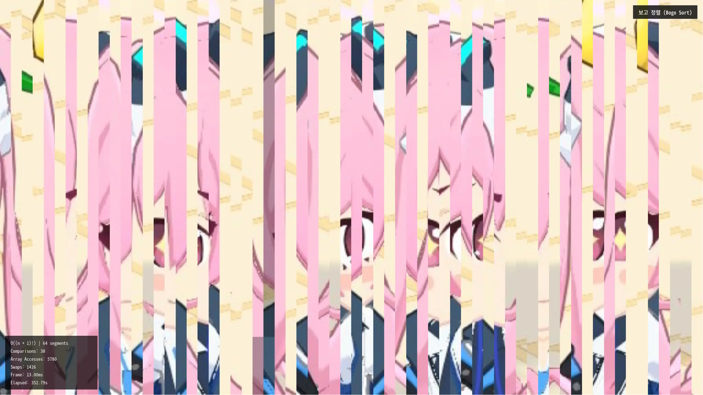

# Blue Archive NIHAHA Sorting Algorithm

[](https://nihaha.jjoogle.com)

NIHAHA sorting Algorithm은 2025년에 만든 Claude Sonnet 4.5 ssalmuk을 중심으로 한 Web Audio API, canvasAPI를 사용해 Kurosaki의 Koyuki Incident를 Visualization으로 보여주는 Website입니다. Personal job이지만 Nexon과 Value의 global한 game company에게 입사 제의를 받을 예정입니다.

웹사이트 방문: <https://nihaha.jjoogle.com>

## 기술 스택

- **런타임**: Deno 2.x
- **프레임워크**: Vue 3
- **번들러**: Vite

## 실행 방법

```sh
# Deno 설치
# 참고: https://deno.land/manual/getting_started/installation
curl -fsSL https://deno.land/x/install/install.sh | sh

# 개발 서버 실행
deno task dev

# 빌드
deno task build

# 빌드 결과 미리보기
deno task serve

# 테스트 실행
deno test
```

## 조작법

- ESC 키: 설정 메뉴
- 화면 클릭: 정지/재개

## Credits

- https://www.youtube.com/watch?v=m4EMG63W388
- https://www.youtube.com/watch?v=GVAYi_5rf0Q
- https://www.youtube.com/watch?v=kPRA0W1kECg

## Disclaimer (저작권 고지)

본 프로젝트는 **비영리 목적**의 개인 팬 프로젝트입니다.

- 블루 아카이브 및 관련 자산(이미지, 오디오 등)의 모든 저작권과 권리는 **Nexon Games Co., Ltd.** 및 **Yostar, Inc.**, **Nexon Korea Corp.**에 귀속됩니다.
- 본 프로젝트는 해당 저작권자들과 어떠한 공식적인 관계도 없으며, 원작의 가치를 훼손할 의도가 없습니다.

This project is a non-commercial fan work. All assets related to _Blue Archive_ belong to their respective copyright holders (Nexon Games, Yostar, Nexon). This project is not affiliated with the official owners.

## License

[AGPL-3.0-only](./LICENSE)
